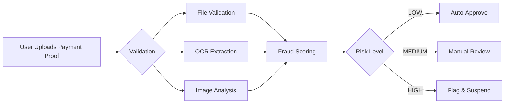
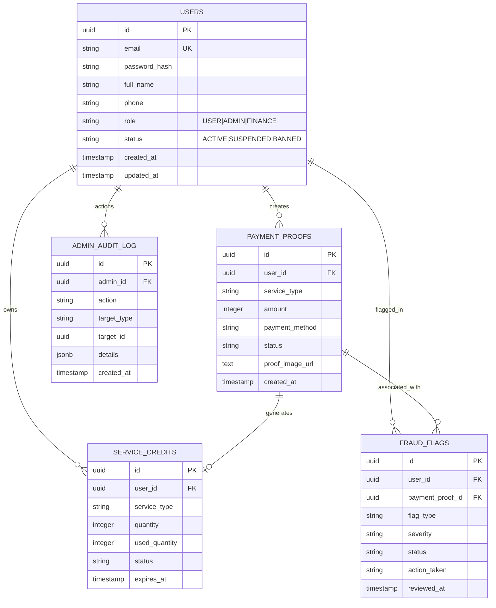

# 🛡️ Aman ga? - Payment Verification System

> **Tanya dulu, transfer kemudian.**
> *Ask first, transfer later.*

[](https://opensource.org/licenses/MIT)
[](https://fastapi.tiangolo.com)
[](https://nextjs.org)
[](https://python.org)
[](https://github.com/Therealratoshen/aman-ga/releases)
[](./SELF-LEARNING-OCR.md)

[](https://github.com/Therealratoshen/aman-ga)
[](https://github.com/Therealratoshen/aman-ga/commits/main)

### 🔗 Quick Links

| 📄 **Documentation** | 🎨 **Live Demo** | 💻 **Source Code** |
|---------------------|------------------|-------------------|
| [GitHub Pages](https://therealratoshen.github.io/aman-ga/) | _Coming Soon_ | [GitHub Repo](https://github.com/Therealratoshen/aman-ga) |

> **✨ NEW in v2.1:** Self-learning OCR system, modern smooth UI, uncertainty reporting, and automated deployment scripts!

---

## 📖 Table of Contents

- [What is Aman ga?](#-what-is-aman-ga)
- [✨ Features](#-features)
- [🆕 What's New in v2.1](#-whats-new-in-v21)
- [🎯 Quick Start](#-quick-start)
- [📋 Demo Credentials](#-demo-credentials)
- [🏗️ Architecture](#️-architecture)
- [📁 Project Structure](#-project-structure)
- [🔌 API Endpoints](#-api-endpoints)
- [💰 Service Pricing](#-service-pricing)
- [🧪 Testing](#-testing)
- [🚀 Deployment](#-deployment)
- [🛡️ Security](#️-security)
- [🧠 Self-Learning OCR](#-self-learning-ocr)
- [📊 Database Schema](#-database-schema)
- [🤝 Contributing](#-contributing)
- [📄 License](#-license)
- [📞 Support](#-support)

---

## 🎯 What is Aman ga?

**Aman ga?** is a comprehensive **payment verification platform** designed for the Indonesian market to help users verify if online transactions are safe before transferring money.

### The Problem We Solve

In Indonesia, online fraud is rampant. People need a way to:
- ✅ Verify if a seller/service is legitimate
- ✅ Check payment proofs before releasing services
- ✅ Get expert analysis on suspicious transactions
- ✅ Report and flag fraudulent activities

### How It Works



1. **User registers** and purchases a service package
2. **Uploads payment proof** (screenshot of transfer)
3. **System validates**:
   - File validation (size, MIME, dimensions)
   - OCR extraction with confidence scoring
   - Image manipulation detection
   - Duplicate detection
4. **Fraud scoring** (0-200 points) determines risk level
5. **Decision**: Auto-approve, Manual Review, or Flag
6. **Service credit activated** → User can perform fraud checks

---

## ✨ Features

### 🔐 Authentication & Authorization
- ✅ JWT-based authentication
- ✅ Role-based access control (USER, ADMIN, FINANCE)
- ✅ Secure password hashing (bcrypt)
- ✅ Token expiration & refresh

### 💳 Payment Processing
- ✅ **Auto-Approval** for payments < Rp 1.000
- ✅ Manual admin review for larger amounts
- ✅ Image upload for payment proofs
- ✅ Multiple payment methods (Bank Transfer, E-Wallets)
- ✅ Payment history tracking

### 🛡️ Fraud Detection
- ✅ Risk scoring algorithm (0-200 points)
- ✅ Duplicate transaction detection (3 types)
- ✅ Pattern analysis
- ✅ Automatic user suspension for confirmed fraud
- ✅ Fraud flag review system

### 🧠 Self-Learning OCR ⭐ NEW v2.1
- ✅ Receipt format database (13 Indonesian providers)
- ✅ Uncertainty reporting with alternatives
- ✅ User feedback loop for continuous learning
- ✅ Confidence scoring (never 100%)
- ✅ OCR pattern refinement from corrections

### 🎨 Modern UI ⭐ NEW v2.1
- ✅ Smooth animations and transitions
- ✅ Real-time validation feedback
- ✅ Confidence visualization
- ✅ Interactive feedback interface
- ✅ Responsive design (mobile-friendly)

### 👮 Admin Dashboard
- ✅ Pending payment review queue
- ✅ Approve/Reject payments with notes
- ✅ Flag users for fraud
- ✅ Real-time statistics
- ✅ Complete audit log

### 📱 User Interface
- ✅ Responsive design (mobile-first)
- ✅ Beautiful gradient UI (Tailwind CSS)
- ✅ Real-time notifications
- ✅ Service credit tracking
- ✅ Payment history view

### 🔔 Notifications (Optional)
- ✅ WhatsApp integration (Fonnte)
- ✅ Email integration (SendGrid)
- ✅ Mock mode for development

---

## 🆕 What's New in v2.1

### 🧠 Self-Learning OCR System

The system now learns from every user interaction:

- **Receipt Format Database**: Pre-configured for 13 Indonesian providers (BCA, BRI, Mandiri, GoPay, OVO, DANA, etc.)
- **Uncertainty Reporting**: Never 100% confident - always shows alternative interpretations
- **User Feedback Loop**: Every correction improves the system
- **Confidence Scoring**: Field-level confidence with visual indicators
- **Continuous Learning**: Accuracy improves over time

### 🎨 Modern Smooth UI

Beautiful new interface with:

- Smooth animations (fade, slide, scale)
- Real-time validation feedback
- Confidence visualization meters
- Interactive feedback interface
- Responsive design (works on all devices)

### 🛡️ Enhanced Security

- Multi-layer validation (file, OCR, image, fraud)
- Rate limiting with IP blocking
- Perceptual hashing for duplicate detection
- Image manipulation detection (ELA, metadata, noise)
- Comprehensive audit logging

### 🚀 Easy Deployment

- Automated deployment script (`deploy.sh`)
- Systemd service configuration
- Nginx reverse proxy setup
- One-command deployment to any VPS

### 📚 Complete Documentation

7 new comprehensive guides:
- `SELF-LEARNING-OCR.md` - OCR system details
- `SECURITY-IMPROVEMENTS.md` - Security features
- `DEPLOYMENT-SERVER.md` - Server deployment guide
- `QUICK-REFERENCE.md` - Common commands
- `DOCUMENTATION-INDEX.md` - Navigation index
- `FINAL-CHECKLIST.md` - Production checklist
- `IMPLEMENTATION-SUMMARY.md` - Implementation details

---

## 🎯 Quick Start

### Option 1: Mock Mode (Recommended for Testing) ⭐

**No external services needed!** Test everything locally in 5 minutes.

```bash
# 1. Clone repository
git clone https://github.com/Therealratoshen/aman-ga.git
cd aman-ga

# 2. Start Backend (Terminal 1)
cd backend
python3 -m venv venv
source venv/bin/activate  # Windows: venv\Scripts\activate
pip install -r requirements.txt
uvicorn main:app --reload --port 8000

# Look for this message:
# 🎯 MOCK MODE: Using in-memory database for testing
#    Demo accounts:
#    - Admin: admin@amanga.id / admin123
#    - Finance: finance@amanga.id / admin123

# 3. Start Frontend (Terminal 2)
cd frontend
npm install
npm run dev

# 4. Open browser
# http://localhost:3000
```

**✅ Ready to test!** Login with demo credentials below.

---

### Option 2: Production Mode (With Supabase)

For persistent data and production deployment:

```bash
# 1. Create free Supabase project
# Go to: https://supabase.com
# Create project → Copy URL and anon key

# 2. Run database schema
# SQL Editor → New Query → Paste database/schema.sql → Run

# 3. Configure backend
cd backend
cp .env.example .env
nano .env  # Edit with your Supabase credentials

# 4. Restart backend
uvicorn main:app --reload --port 8000
```

See [QUICKSTART.md](./QUICKSTART.md) for detailed setup guide.

---

## 📋 Demo Credentials

| Role | Email | Password | Access Level |
|------|-------|----------|--------------|
| **👑 Admin** | admin@amanga.id | admin123 | Full access, fraud flagging |
| **💰 Finance** | finance@amanga.id | admin123 | Approve/reject payments |
| **👤 User** | Register new | Your choice | Purchase & use services |

**Try these steps:**
1. Login as **Admin** → Explore admin dashboard
2. Register **new user** → Purchase service → Upload payment
3. Logout → Login as **Finance** → Approve payment
4. Check user dashboard → See activated credit

---

## 🏗️ Architecture

```
┌─────────────────────────────────────────────────────────────┐
│                         CLIENT LAYER                         │
│  ┌─────────────┐  ┌─────────────┐  ┌─────────────┐         │
│  │   Desktop   │  │   Mobile    │  │   Tablet    │         │
│  └─────────────┘  └─────────────┘  └─────────────┘         │
└─────────────────────────────────────────────────────────────┘
                            │
                            ▼ HTTP/JSON
┌─────────────────────────────────────────────────────────────┐
│                      PRESENTATION LAYER                      │
│  ┌─────────────────────────────────────────────────────┐    │
│  │           Next.js 14 Frontend (React)               │    │
│  │           • Tailwind CSS                           │    │
│  │           • Axios HTTP Client                      │    │
│  │           • JWT Authentication                     │    │
│  └─────────────────────────────────────────────────────┘    │
└─────────────────────────────────────────────────────────────┘
                            │
                            ▼ REST API
┌─────────────────────────────────────────────────────────────┐
│                       APPLICATION LAYER                      │
│  ┌─────────────────────────────────────────────────────┐    │
│  │            FastAPI Backend (Python)                 │    │
│  │  ┌──────────┐ ┌──────────┐ ┌──────────┐            │    │
│  │  │   Auth   │ │ Payment  │ │  Fraud   │            │    │
│  │  │ Service  │ │ Service  │ │ Service  │            │    │
│  │  └──────────┘ └──────────┘ └──────────┘            │    │
│  └─────────────────────────────────────────────────────┘    │
└─────────────────────────────────────────────────────────────┘
                            │
                            ▼ SQL
┌─────────────────────────────────────────────────────────────┐
│                        DATA LAYER                            │
│  ┌─────────────┐  ┌─────────────┐  ┌─────────────┐         │
│  │  Supabase   │  │    Mock     │  │   Storage   │         │
│  │  PostgreSQL │  │   Database  │  │  (Images)   │         │
│  └─────────────┘  └─────────────┘  └─────────────┘         │
└─────────────────────────────────────────────────────────────┘
```

---

## 📁 Project Structure

```
aman-ga/
├── 📂 backend/                    # FastAPI Backend
│   ├── main.py                   # 📄 API endpoints (414 lines)
│   ├── auth.py                   # 🔐 JWT authentication
│   ├── database.py               # 💾 Database client (Supabase/Mock)
│   ├── mock_database.py          # 🎭 In-memory mock database ⭐ NEW
│   ├── models.py                 # 📋 Pydantic schemas
│   ├── requirements.txt          # 📦 Python dependencies
│   ├── .env.example              # ⚙️ Environment template
│   └── 📂 services/
│       ├── payment.py            # 💳 Payment processing
│       ├── fraud.py              # 🛡️ Fraud detection
│       └── notification.py       # 🔔 WhatsApp/Email
│
├── 📂 frontend/                   # Next.js Frontend
│   ├── 📂 pages/
│   │   ├── index.js              # 🏠 Login/Register
│   │   ├── dashboard.js          # 📊 User dashboard
│   │   ├── admin.js              # 👮 Admin panel
│   │   └── payment.js            # 💳 Payment history
│   ├── 📂 components/
│   │   ├── PaymentUpload.js      # 📸 Upload modal
│   │   ├── ServiceCard.js        # 💎 Service pricing
│   │   └── AdminDashboard.js     # 📈 Admin view
│   ├── 📂 styles/
│   │   └── globals.css           # 🎨 Tailwind CSS
│   ├── package.json              # 📦 NPM dependencies
│   └── next.config.js            # ⚙️ Next.js config
│
├── 📂 database/
│   ├── schema.sql                # 🗄️ Database schema
│   └── seed.sql                  # 🌱 Test data
│
└── 📂 docs/
    ├── README.md                 # 📖 This file
    ├── QUICKSTART.md             # 🚀 Setup guide (5 min)
    ├── API-KEY-SETUP.md          # 🔑 API key acquisition
    ├── TEST-REVIEW.md            # ✅ Code review report
    └── DEPLOYMENT-OPTIONS.md     # ☁️ Deployment comparison
```

---

## 🔌 API Endpoints

### Authentication

| Method | Endpoint | Description | Auth Required |
|--------|----------|-------------|---------------|
| `POST` | `/register` | Register new user | ❌ |
| `POST` | `/token` | Login (get JWT token) | ❌ |
| `GET` | `/me` | Get current user | ✅ |

**Example: Login**
```bash
curl -X POST "http://localhost:8000/token" \
  -H "Content-Type: application/x-www-form-urlencoded" \
  -d "username=admin@amanga.id&password=admin123"
```

### Payment

| Method | Endpoint | Description | Auth Required |
|--------|----------|-------------|---------------|
| `POST` | `/payment/upload` | Upload payment proof | ✅ |
| `GET` | `/payment/my` | Get payment history | ✅ |
| `GET` | `/payment/credits` | Get service credits | ✅ |

**Example: Upload Payment**
```bash
curl -X POST "http://localhost:8000/payment/upload" \
  -H "Authorization: Bearer YOUR_TOKEN" \
  -F "service_type=CEK_DASAR" \
  -F "amount=1000" \
  -F "payment_method=BANK_TRANSFER" \
  -F "bank_name=BCA" \
  -F "transaction_id=TRX123" \
  -F "transaction_date=2024-01-01T10:00:00" \
  -F "proof_image=@screenshot.png"
```

### Admin (Requires ADMIN or FINANCE role)

| Method | Endpoint | Description | Auth Required |
|--------|----------|-------------|---------------|
| `GET` | `/admin/payments/pending` | Get pending payments | ✅ |
| `POST` | `/admin/payment/{id}/approve` | Approve payment | ✅ |
| `POST` | `/admin/payment/{id}/reject` | Reject payment | ✅ |
| `POST` | `/admin/payment/{id}/flag` | Flag as fraud | ✅ |
| `GET` | `/admin/stats` | Dashboard statistics | ✅ |

**Example: Approve Payment**
```bash
curl -X POST "http://localhost:8000/admin/payment/PAYMENT_ID/approve?notes=Verified" \
  -H "Authorization: Bearer ADMIN_TOKEN"
```

### Service

| Method | Endpoint | Description | Auth Required |
|--------|----------|-------------|---------------|
| `GET` | `/service/use/{type}` | Use service credit | ✅ |

### Health Check

| Method | Endpoint | Description | Auth Required |
|--------|----------|-------------|---------------|
| `GET` | `/health` | Server status | ❌ |

**📖 Full API Documentation:** http://localhost:8000/docs (Swagger UI)

---

## 💰 Service Pricing

| Service | Price | Auto-Approve | Processing Time | Description |
|---------|-------|--------------|-----------------|-------------|
| **🥉 Cek Dasar** | Rp 1.000 | ✅ Yes | Instant | Basic OJK/Kominfo check |
| **🥈 Cek Deep** | Rp 15.000 | ❌ Manual | 5-30 min | AI chat analysis |
| **🥇 Cek Plus** | Rp 45.000 | ❌ Manual | 5-30 min | Contract + legal letter |

### Auto-Approval Rules

Payments are auto-approved when ALL conditions are met:
- ✅ Amount ≤ Rp 1.000
- ✅ Service type = CEK_DASAR
- ✅ No fraud history for user
- ✅ Passes 10% random audit check

---

## 🧪 Testing

### Test Flow (Mock Mode)

```bash
# 1. Start backend (Terminal 1)
cd backend
source venv/bin/activate
uvicorn main:app --reload --port 8000

# 2. Start frontend (Terminal 2)
cd frontend
npm run dev

# 3. Open http://localhost:3000
```

### Test Scenarios

#### Scenario 1: User Registration & Purchase
1. Register new account
2. Login with new credentials
3. Purchase "Cek Dasar" (Rp 1.000)
4. Upload payment proof (any image)
5. See instant auto-approval ✅
6. Service credit activated in dashboard

#### Scenario 2: Admin Approval
1. Login as admin (`admin@amanga.id` / `admin123`)
2. Navigate to Admin Panel
3. See pending payment (if amount > Rp 1.000)
4. Click "Approve" or "Reject"
5. Add verification notes
6. User receives notification

#### Scenario 3: Fraud Detection
1. Login as admin
2. Flag suspicious payment
3. Select flag type: FAKE_PROOF
4. Select severity: HIGH
5. User automatically suspended
6. Service credits revoked

### API Testing

```bash
# Health check
curl http://localhost:8000/health

# Register user
curl -X POST "http://localhost:8000/register" \
  -H "Content-Type: application/json" \
  -d '{
    "email": "test@example.com",
    "password": "test123",
    "full_name": "Test User"
  }'

# Login
curl -X POST "http://localhost:8000/token" \
  -H "Content-Type: application/x-www-form-urlencoded" \
  -d "username=test@example.com&password=test123"
```

---

## 🚀 Deployment

### ⚡ Quick Deploy (Recommended)

Deploy to any VPS (Alibaba Cloud, DigitalOcean, etc.) in one command:

```bash
# SSH to your server
ssh root@YOUR_SERVER_IP

# Clone and deploy
git clone https://github.com/Therealratoshen/aman-ga.git
cd aman-ga
sudo ./deploy.sh
```

**That's it!** The script will:
- ✅ Install all dependencies (Python, Tesseract OCR, Nginx)
- ✅ Setup Python virtual environment
- ✅ Configure Nginx as reverse proxy
- ✅ Setup systemd service for auto-start
- ✅ Configure firewall
- ✅ Start everything automatically

### 📚 Deployment Options

| Method | Best For | Setup Time | Cost |
|--------|----------|------------|------|
| **Simple Application Server** | Production | 5 min | $5-10/month |
| **Docker** | Development | 10 min | Free |
| **Vercel + Railway** | Testing | 15 min | Free |

### 📖 Deployment Guides

- **[DEPLOYMENT-SERVER.md](./DEPLOYMENT-SERVER.md)** - Complete server deployment guide
- **[QUICK-REFERENCE.md](./QUICK-REFERENCE.md)** - Common commands & troubleshooting
- **[DEPLOYMENT-OPTIONS.md](./DEPLOYMENT-OPTIONS.md)** - Cloud provider comparison
- **[QUICKSTART.md](./QUICKSTART.md)** - Basic setup (5 min)
- **[API-KEY-SETUP.md](./API-KEY-SETUP.md)** - WhatsApp/Email setup

### 🔧 Server Requirements

```
- OS: Ubuntu 20.04+ / CentOS 7+
- RAM: 2GB minimum (4GB recommended)
- Storage: 10GB free space
- Python: 3.10+
```

### 🌐 After Deployment

Access your application:
- **Frontend**: `http://YOUR_SERVER_IP/`
- **API Docs**: `http://YOUR_SERVER_IP/docs`
- **Health Check**: `http://YOUR_SERVER_IP/health`

**Production Setup:**
1. Edit `.env` with Supabase credentials
2. Set `MOCK_MODE=False`
3. Install SSL certificate: `sudo certbot --nginx`
4. Change default passwords

---

## 🛡️ Security

### Authentication
- ✅ JWT tokens with 30-minute expiration
- ✅ Password hashing with bcrypt (12 rounds)
- ✅ Role-based access control (RBAC)
- ✅ Protected routes with middleware
- ✅ Rate limiting (login, upload, API)
- ✅ IP blocking after violations

### Data Protection
- ✅ SQL injection prevention (Supabase client)
- ✅ Input validation (Pydantic + custom validators)
- ✅ CORS configuration (hardened)
- ✅ XSS protection headers
- ✅ Security headers (HSTS, CSP, etc.)
- ✅ File validation (MIME, size, dimensions)

### Fraud Prevention
- ✅ Risk scoring algorithm (0-200 points)
- ✅ Duplicate transaction detection (3 types)
- ✅ Image manipulation detection (ELA, metadata, noise)
- ✅ OCR verification with form matching
- ✅ Automatic suspension for confirmed fraud
- ✅ Audit logging for all admin actions
- ✅ Perceptual hashing for image duplicates

### Production Ready
- ✅ HTTPS/SSL (Certbot)
- ✅ Rate limiting enabled
- ✅ CSRF protection headers
- ✅ Comprehensive logging
- ✅ Automated backups support

---

## 📊 Database Schema

### Entity Relationship Diagram



### Tables Overview

| Table | Purpose | Key Fields |
|-------|---------|------------|
| `users` | User accounts | email, role, status |
| `payment_proofs` | Payment records | amount, status, proof_image_url |
| `service_credits` | Service usage tracking | quantity, used_quantity, expires_at |
| `fraud_flags` | Fraud detection | flag_type, severity, action_taken |
| `admin_audit_log` | Admin action tracking | action, target_type, details |

---

## 🤝 Contributing

Contributions are welcome! Please follow these steps:

1. **Fork** the repository
2. **Create** feature branch (`git checkout -b feature/amazing-feature`)
3. **Commit** changes (`git commit -m 'Add amazing feature'`)
4. **Push** to branch (`git push origin feature/amazing-feature`)
5. **Open** Pull Request

### Development Setup

```bash
# Backend
cd backend
python3 -m venv venv
source venv/bin/activate
pip install -r requirements.txt

# Frontend
cd frontend
npm install
npm run dev
```

### Code Style

- **Python:** PEP 8, type hints where possible
- **JavaScript:** ESLint (Next.js recommended)
- **Commits:** Conventional Commits format

---

## 📄 License

MIT License - feel free to use for learning or commercial projects.

See [LICENSE](./LICENSE) for details.

---

## 📞 Support

### Documentation
- [📖 Quick Start](./QUICKSTART.md) - Setup in 5 minutes
- [🔑 API Keys](./API-KEY-SETUP.md) - Get WhatsApp/Email keys
- [🧪 Test Review](./TEST-REVIEW.md) - Complete code review
- [☁️ Deployment](./DEPLOYMENT-OPTIONS.md) - Cloud provider comparison
- [📡 API Docs](http://localhost:8000/docs) - Swagger UI (when running)

### Links
- **GitHub:** https://github.com/Therealratoshen/aman-ga
- **Issues:** https://github.com/Therealratoshen/aman-ga/issues
- **Discussions:** https://github.com/Therealratoshen/aman-ga/discussions

### Contact
For questions or support, please open an issue on GitHub.

---

## 🙏 Acknowledgments

Built with ❤️ for Indonesian market safety.

### Tech Stack
- [FastAPI](https://fastapi.tiangolo.com) - Modern Python web framework
- [Next.js](https://nextjs.org) - React framework
- [Supabase](https://supabase.com) - Open source Firebase alternative
- [Tailwind CSS](https://tailwindcss.com) - Utility-first CSS
- [Python](https://python.org) - Programming language
- [React](https://react.dev) - UI library

### Inspiration
This project was built to help Indonesians verify online transactions and avoid fraud.

---

## 📈 Project Status

| Milestone | Status | Date |
|-----------|--------|------|
| POC Development | ✅ Complete | Mar 2026 |
| Mock Mode | ✅ Complete | Mar 2026 |
| Documentation | ✅ Complete | Mar 2026 |
| Frontend UI | ✅ Complete | Mar 2026 |
| Backend API | ✅ Complete | Mar 2026 |
| Production Deployment | 🔄 Ready | - |

**Last Updated:** March 15, 2026

---

<div align="center">

### 🛡️ Aman ga? - Tanya dulu, transfer kemudian.

[⭐ Star this repo](https://github.com/Therealratoshen/aman-ga/stargazers) • [🍴 Fork it](https://github.com/Therealratoshen/aman-ga/fork) • [📋 Issues](https://github.com/Therealratoshen/aman-ga/issues)

**Made with ❤️ in Indonesia**

</div>
